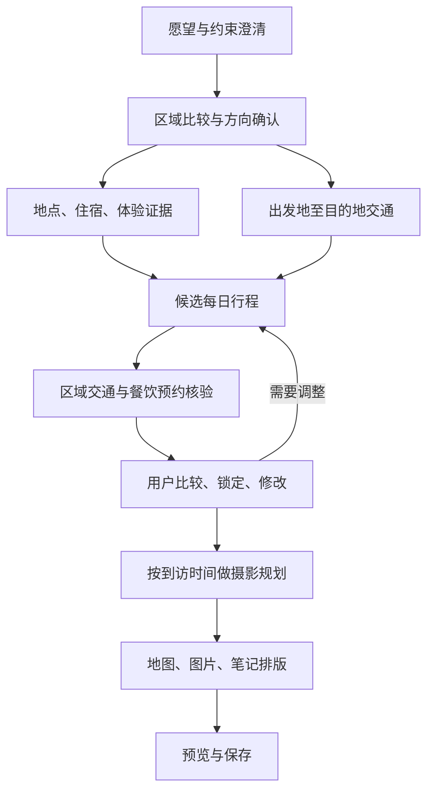

# Quantum 旅行笔记：从模糊想法到可调整行程

日期：2026-09-27。修订：v3，纳入已批准的 JEV 边界与本地实现。状态：本地开发及验收；未提交、未推送、未部署。前文保留目标设计，实际交付范围与限制以第 20 节及 completion manifest 为准。

## 1. 产品定位与本次决策

QWS 不作为本功能的参照或依赖。本次把通用交互与工作流能力做好，后续 QWS 可复用本次成果。

沿用「需求澄清 → 任务拆解 → 研究执行 → 阶段确认 → 成果交付」主路径。旅行笔记是同一工作流中的专业成果类型，不另外建设旅行聊天系统、调度器或笔记数据库。

关键区别：旅行规划存在时间、空间、预约、同行人和个人偏好的约束，用户会反复修改。最终笔记应是已确认行程的可读投影；不能把一篇生成的 Markdown 当成全部状态，再靠每次重写维持一致性。

本轮推荐确认三个边界：

1. 在现有 Workflow 成果中增加旅行契约，沿用现有任务、版本、审核和笔记存储。
2. 支持按日／地点提出修订，锁定已确认事项，并对受影响的交通、餐饮、摄影和地图重新校验。
3. 扩展现有私有图片链，纳入网络图片与截图；新增原生设计地图渲染，地图数据与行程同源。

不自动代订机票、酒店、餐厅，不将“提供预约攻略”混同于已预约。开发范围包含收集预约入口和操作步骤；发生真实外部预订时另走显式授权。

## 2. 已验证的代码现状

检查对象：`/Users/dengzhaoyu/Desktop/TepVis/Quantum-2.0`。首轮 HEAD `b07e2cc4fd6c0bcd299990ec58d474761134e577`；v2 补充检查时 HEAD 已推进至 `f7e6fa9c88fb5896ed37eb37bfa1a8cdb40dd072`，工作区仍有其他任务改动。以下为源码观察，不代表线上或设备版本已验证；补充结论详见第 12–18 节。

| 能力 | 判断 | 证据及限制 |
|---|---|---|
| 通用需求澄清 | 已实现基础机制 | `backend/api/workflows.py` 的创建、clarification/respond；`backend/services/clarification_planner.py` 调用 Hermes；还需旅行维度及收敛条件 |
| PPT、Word、HTML 场景 | 已有主路径 | `backend/services/presentation_scenario.py`、`workflow_planner.py`；创建参数的 output_kind 目前只有 general/presentation/document/html |
| 成果审核与版本 | 已实现基础机制 | `review-stage` 校验 artifact id、hash、version；不能直接推断所有旅行阶段已适配 |
| 成果退回 | 部分满足 | `request-revision` 与 `_reset_from_node` 按 position 重置后续节点，不是逐日、逐依赖失效 |
| 旅行偏好界面 | 原型性质 | `ChatStatusCards.swift` 的 TravelPlanPreferencesView 有本地选择，但 `onGenerate: () -> Void` 不传选择值；日期和目的地含固定示例 |
| 旅行成果与保存 | 部分实现 | `WorkflowDashboardView.swift` 识别 travel_plan_v1/标题关键词；`KnowledgeView.swift` 的 TravelNoteSaveSheet 只回传标题及原 content，封面及包含项尚未进入保存载荷 |
| 旅行笔记 | 已有基础 | TravelPlanDocument 包含目的地、日期、预算、同行人数、style、stops；缺乏日程、交通段、来源与预约的结构化表达 |
| 地图 | 原生基础地图 | TravelRouteMap 用 MapKit 底图和 stops 顺序连线；不是导航计算，也不是自定义旅行制图 |
| 图片 | 已有生成图闭环 | `backend/services/note_illustrations.py`、KnowledgeNoteStore 私有资产下载与哈希校验；当前偏生成插画，旅行锚点为 stop:index |
| QWS | 不在本次依赖范围 | 后续由 QWS 借鉴本次成熟能力，本次不读取或依赖其业务协议 |

## 3. 用户路径：先收敛，再深入

### 3.1 从一句愿望开始

例如：“想去日本，体验安静小众的秘汤，吃和牛与松叶蟹，不想去大众地方。”

第一条回复先展示已理解的愿望与未知，不擅自填京都、天数或预算。每轮聚焦一个关键问题、提供少量建议选项，始终允许自由输入、补充附件和“还没想好”；选项不是答案边界。第一轮优先：大致月份／天数、出发城市、是否愿意自驾。下一轮根据缺口询问预算、同行人、住宿及摄影偏好，不重复问已回答项。

“小众”应收敛成可执行偏好：少排队、少人、安静、少购物、愿意多远转车、能接受怎样的设施。地理偏远不自动等于安静或符合需求。温泉还要了解公共浴场／私汤倾向和行动便利需求；不过度收集个人敏感信息。

允许先比较方向而不确定日期。界面明确区分「已确认」「暂按此考虑」「待决定」，每一项均可修改；没有日期时只提供季节方向，不虚构营业、班次、蟹供应和预约可用性。

### 3.2 收敛成 2–3 个方向

进行一轮有界的可行性研究，再提供方向卡。每张卡包含：契合愿望的理由、可能牺牲的体验、交通负担、住宿形态、预算区间的证据和待核实项。不能仅给一组景点让用户猜区域差异。

本例必须验证的矛盾是：“少人 + 秘汤 + 指定食材 + 有限天数 + 不自驾”能否同时成立；这里是待验证问题，不预判哪一区域满足。秘汤协会会员身份查官网；食材季节／来源查餐厅或旅馆；预约和交通另查对应官网。

用户选择方向后生成可编辑的「旅行约定」：硬条件、软偏好、愿意牺牲项、已排除方案及理由、暂定假设。用户可以确认方向进入研究，也可以要求重新比较。

收敛条件不是固定问满三轮：能确定研究范围，关键未知已明确为阻塞或暂定，并且用户确认当前理解。用户说“先按你建议做”时可用显式假设推进；不把缺失字段当作已确认事实。

## 4. 任务拆分与来源策略

六个业务模块保留，但不能六条互不相干地写完再拼接。地点初筛可与跨国交通研究同时推进；每日餐饮、摄影和区域内交通必须消费当前候选行程。



| 模块 | 具体输出 | 依赖与核验 |
|---|---|---|
| 地点与体验 | 候选地点、住宿、做什么、为什么适合、建议停留、备选 | 官方资料确定开放与会员身份；社交内容补体验线索；重复地点合并为同一 place_id |
| 交通 | 国际／跨城／当地交通段；公共交通、自驾、包车比较 | 出发时间、时区、换乘、末班、旅馆接驳、行李、缓冲；价格和时刻带查询日期；未知不填估计为确定值 |
| 餐饮 | 当日午晚餐候选、离行程偏移、菜单／预算、预约指南、替代项 | 以游玩点、住宿、车站为锚点；日本用 Tabelog 等本地来源作线索，再查店家；其他国家选择当地适用平台，不生搬日本评分 |
| 行程 | 每日时间窗、体验、移动、住宿、休息、雨天替代 | 必须检查可达性、营业与预约、换乘缓冲和旅馆晚餐；发呆是明确留白，不塞景点 |
| 摄影 | 地点、到访时段、机位方向、构图、拍摄内容、参考图、视频镜头清单 | 依据用户设备、风格和投入时间；天气／日照信息标明来源或估算；摄影目标不能挤掉主体验 |
| 笔记 | 概览、总地图、每日页、地点页、交通、餐饮、摄影、待办、来源 | 只消费当前版本与已确认内容；未决项保留可见，不美化成已落实 |

平台是可用来源，不是“全部必须打卡搜索”的清单。按每个问题选择官网、Google Maps、X、Instagram、小红书、抖音、TikTok、Reddit及公开网页；记录实际成功、空结果、未登录、限流和不可用。不得声称访问了未访问的平台。

Google Maps「星标」需区分：用户私人收藏、评分地点和其他评级体系。私人收藏需用户提供可访问的清单或在授权会话中读取，不能假定可见。餐厅评分不能自动当成米其林星级。

建议的执行顺序：已配置的检索／平台工具 → 官方页面 → 已授权浏览器补充 → 明确缺口。用户提到的 finder 尚未在本次源码检查中确认为可调用的浏览器执行工具；实施时核对真实工具名与权限，不能把桌面 Finder 当作浏览器能力。需要登录／验证码时保留进度并提示用户接管。

每个事实保留 source_id、原始 URL、标题、平台、采集时间、事实对应段落或截图、适用日期、核验状态。社交帖子是体验证据，不替代营业时间等事实核验。同名地点必须核对坐标、地址与官方链接。

## 5. 反复修改：前后端共同承担

### 5.1 界面结构

iPhone 保留现有旅行笔记导航，以「概览／每日／地点／待办」承载成果；规划中从同一旅行任务进入「继续讨论」。宽屏可左右并排讨论与笔记预览；不是要求本轮另建 Web 客户端。

```text
安静的日本温泉之旅                         继续讨论
日期待决定 · 当前为草案                    查看变化
[旅行约定]  [整体路线]  [Day 1] [Day 2] …

┌─────────────────────────────┐
│         定制路线地图          │
│   地点编号、交通方式、日序      │
└─────────────────────────────┘
今日主题 / 留白时间 / 交通负担
上午  体验卡      [保留] [替换] [删去]
中午  餐厅卡      [预约指南] [查看来源]
下午  自由时间    [调整]
晚上  住宿卡      [已预订，锁定]

对这一天说： “少坐车，下午留给泡汤”
变更预览：删去 1 处；更换午餐；摄影移到次日
[采用这个版本]  [继续调整]  [保留原计划]
```

用户能锁定某一天、地点、酒店、时间或预约。锁定不是禁止讨论，而是禁止 AI 静默改动；出现冲突时说明“保持酒店后，无法在这个时间完成该体验”，给出替代。

“换一家店”“第二天别开车”“延长两天”均在原任务继续。变更预览显示增加、删去、移动、价格／时长变化和仍未知项；采用后才切换当前版本。草案生成中继续读旧版，失败不丢旧版。

### 5.2 数据与一致性

- 原始用户输入保留在既有会话；确认约束保存在 requirements_snapshot；来源、行程、资产清单作为既有 WorkflowArtifact 版本化成果。
- 所有修改携带基础成果 id/hash/version 和稳定的 day_id、place_id、visit_id。地点可多次到访，因此 visit 与 place 分开引用。
- 服务端校验租户归属、版本、锁定约束；版本过期返回冲突和最新版本，不采用最后写入覆盖。
- “当前采用版本”由已有审核／成果记录确定；旧稿可看可恢复。恢复产生新采用记录，不改写历史。
- 依赖以日／地点／时间／版本引用表达。改变住宿使当地交通、周边餐饮与相关地图待重算；改变日期使营业、班次、预约、摄影时间待复核；只改标题不重跑研究。
- v1 复用当前后续节点重跑机制，但将受影响范围传给对应节点，并在复用旧子结果前检查输入哈希。这样可以少算、不丢锁定内容，而无需重写调度器；必须验证运行器确实消费该范围，不能仅写进 prompt。
- 尚未重新核验的结果标为待更新；不允许旧路线配新日程。结果包写入成功后整体切换，地图与正文同一 plan_revision。
- 用户自行写的游记和拍摄记录与 AI 规划字段分开保留；更新行程不得覆盖私人正文或已经插入的照片。

## 6. 最小数据契约（提案，不是已发布接口）

扩展现有 TravelPlanDocument，保留旧 destination/date_range/budget/companions/style/stops/journal/illustrations 兼容读取；旧文档不自动补造新事实。

| 字段 | 所属与必要内容 |
|---|---|
| schema_version | 旅行文档结构版本；不同于成果修订号 |
| workflow_id / artifact_id / plan_revision | 关联既有工作流及工件；由服务端生成和绑定 |
| brief | 目的地候选、出发地、日期窗口、天数、时区、预算币种／人均或总额、同行、节奏、偏好、排除项、假设 |
| places | 稳定 id、名称、类型、地址、可空坐标、坐标来源、来源引用、匹配理由 |
| days | 稳定 id、当地日期、主题、住宿引用、visits、休息段；未定日期可空 |
| visits | 稳定 id、place_id、时间窗、体验说明、停留时长、锁定项、预约引用 |
| legs | 前后 visit_id、交通方式、起止时间及其时区、时长、费用币种、几何／示意状态、查询时间、来源 |
| meals / reservations | 关联 visit/day；菜品、预约方式和链接、备选；预约状态区分未查／需预约／已申请／已确认及用户或凭据来源 |
| photography | 关联 visit、设备偏好、时间依据、机位文字／可空坐标、构图、镜头、参考 asset_id |
| sources | id、URL、标题、publisher/platform、captured_at、适用日期、证据类型、核验状态 |
| assets | id、私有存储引用、SHA256、宽高、来源页、作者、类型、使用范围／权利状态、alt、裁切区域、anchor |
| map_spec | 总览或 day_id、place/visit/leg 引用、主题、视口／分区、图例；是同版本内容的派生布局 |

数据校验：坐标有限数值且合法；外键存在；天内事件排序；跨午夜正确；无日期不声称查得某日班次；费用必须有币种和计价单位；重复请求幂等；不接受客户端自填已确认预约或审核记录冒充系统证明。

新配图锚点采用稳定 `visit:<id>`／`place:<id>`／`day:<id>`，兼容旧 stop:index。否则挪动地点后，原配图会误挂到另一个景点。未知扩展字段在本地编辑与同步时保留。

## 7. 地图：旅行书中的设计页

目标是在笔记中间成为视觉中心，能看懂区域、每日顺序和移动负担，同时与地点卡片联动。导航需求可通过“打开导航”交给地图应用，笔记中的地图保持定制设计。

### 7.1 默认视觉

暖白纸面、深灰文字、低饱和海水蓝／山林绿；路线按日配色并配日序与编号，不能仅靠颜色区分。标题用现有衬线风格，地图标注用清晰无衬线；保留尺度感、方向、简短图例、资料来源。首版一套成熟主题，用户可选强调色、标签密度和显示内容，不开放任意主题系统。

总览：显示区域轮廓／海岸、住宿基地和跨区移动，地点多时收敛为住宿基地与关键锚点，用户展开细节。国际长途段使用分区小地图或行程带，不把跨国距离压进每日街区图。

每日：按 visit 顺序标点，餐厅／温泉／住宿／车站使用清楚的不同符号；当天摄影点可开关；选中地点同步突出对应卡片；支持整体与某天切换、放大和导出同版地图。

### 7.2 几何与工程规则

- 地点坐标、地点名、线路数据来自已核验记录；生成模型不承担精确地理绘制。
- 有可使用的线路几何时绘制实际路线；只有起终点时用虚线标示「示意连接，非实际道路」。不能用直线计算驾车时间。
- 简化底图需独立核验数据许可、归属标注、缓存和导出条件。未选定合适底图前可展示明确标注的地理路线示意图，不虚构道路／地形；这是诚实降级，不是最终精细制图验收。
- v2 选型方向见第 16 节：优先验证 MapLibre GL JS 的全球 3D 与每日设计地图共用一个渲染内核，iOS 用受控 WKWebView 包装，外围交互保持 SwiftUI；不同时引入多个地图引擎。Canvas/静态路线图作为降级方案，后台输出同源 map_spec，不另建地图服务。
- 自适应投影与分区需覆盖一个点、同坐标点、零点、远距离、跨日期变更线；缺坐标的地点在待定位列表，不塞入默认京都坐标。
- 标签避让优先展示选中点和重要地点；隐藏的点仍可从有序列表访问。导出需同版本、无裁切，失效地图显示待更新。

生成插画可以做纸面装饰或主题封面，不能冒充真实地图和实地摄影机位。

## 8. 图片与摄影前后端

图片优先顺序：匹配地点／季节／偏好的合适网络图 → 已授权浏览器页面截图 → 生成插画；用户自己的照片可直接优先采用。每张图标识“实景参考／网页截图／生成插画”，并保留来源。未获取到图片时展示来源卡和重试，不塞无关库存图。

搜索到的摄影参考与笔记装饰分开：参考图需要说明可借鉴的构图、光线、前景、镜头顺序，以及与用户到访条件的差异。截图不自动证明有重用许可；可访问性和公开分享权限分别记录，导出前排除不可分享素材或保留来源链接。

复用现有图片持久任务和认证资产读取。新增网络获取只接受受控检索／浏览器结果，限制协议、重定向、私网／环回／元数据地址、体积、像素及类型，下载后解码重编码并去除无关隐私元数据；不得把远程任意 URL 直接接到现有私有下载接口。

前端图片卡支持：选择／替换、裁切、来源、类型、说明、删除；摄影参考支持保存到相应到访点。请求绑定正文及成果版本，晚到结果不覆盖新稿。地图和配图失败可单独重试，不重新问用户整套旅行需求。

## 9. 实施范围与顺序

以下为预计修改位置，正式实施前还需针对当前 HEAD 追踪全部调用者。文件数量以完成契约闭环为准，不为每个业务模块建立 service。

| 批次 | 既有位置 | 必要改动与验收 |
|---|---|---|
| 1 输入闭环 | ChatStatusCards.swift、APIClient.swift、backend/api/workflows.py、PCM workflow_lifecycle 及实际绑定 | 删除真实路径占位；偏好真正传输；旅行明确类型路由；澄清、摘要、用户确认、恢复；不可只靠标题关键词 |
| 2 场景与成果 | workflow_planner.py、现有场景构造模式、workflow_runtime.py、workflow_artifacts.py | 在同一调度器添加旅行场景；新增一个必要的旅行契约／校验模块承载专有字段；来源／行程／地图绑定版本；不扩展独立存储 |
| 3 反复修订 | workflows.py 的 review-stage/request-revision、WorkflowDashboardView.swift | 锁定与范围化修订、旧结果复用校验、差异预览、过期冲突、局部失败恢复 |
| 4 阅读及地图 | KnowledgeView.swift、KnowledgeNoteStore.swift | 扩展现有文档和保存；必要时单独提取一个旅行地图 View，避免继续扩大现有巨型文件；每天可读、地图联动、保持用户游记 |
| 5 网图及摄影 | note_illustrations.py、既有图片执行器／API／客户端面板 | 来源与截图入库、资产校验、稳定锚点、摄影参考、失败降级与分享限制 |
| 6 回归验收 | tests/test_workflows_api.py、工作流合同测试、KnowledgeNoteStoreTests.swift 等现有入口 | 旅行全链与旧 PPT/Word/HTML、普通笔记兼容；最小新增旅行契约／地图边界测试 |

不把批次 1 的表单连通称为完整旅行功能；完整验收必须覆盖六个业务模块、真实数据、修订和笔记显示。

## 10. 验收矩阵

1. 模糊日本需求：不预填京都；问出关键缺口；输出不同方向及来源；用户确认后进入有界研究。
2. 未定月份：可比较方向；不得给确定营业日、预约空位或班次；待定标签在笔记保留。
3. 无自驾 + 偏远旅馆：交通查不到时阻塞当日可执行结论，并提供可验证替代；不能用估计时长伪装查到路线。
4. 已锁定旅馆 + 第二天少坐车：保留旅馆，改变受影响行程、餐饮、摄影、地图；用户采用前当前版本不变。
5. 两台设备同时修改：过期版本拒绝覆盖，原始用户游记保留。
6. 旅行提案偏好：实际请求载荷包含用户选择；重开一致；不出现 2024 固定日期。
7. 来源缺失／某平台未登录：显示具体缺口与可继续范围，不声称全网采集成功。
8. 网图下载失败：可用截图时带出处与类型；否则来源卡／生成插画，三种状态区分。
9. 地点重排与删除：图片、预约和摄影引用仍正确；不把旧 stop:index 图片绑定到新地点。
10. 地图零点／单点／重合／跨日期变更线／密集标签：无崩溃，无虚构坐标，顺序可读；大字和 VoiceOver 可操作。
11. 取消或中途断网：既有版本可读；恢复复用成功资产；重复请求不重复生成或覆盖。
12. 保存为笔记：封面和包含选项实际生效；私有与分享设置不得只有界面无权限实现；存后重开信息一致。
13. 回归：PPT、Word、HTML 的创建、阶段审核、版本校验仍通过；旧旅行 JSON 和普通笔记均可读取。
14. 集成验收分别记录：检索真实结果、后台产物、认证资产字节、iOS 实际显示、用户修订后的同版本输出；Mock 测试不能代替真实连接验证。

## 11. 未知与待确认

- 尚未验证生产 Hermes 的平台检索工具、浏览器执行器、账号登录态、Google Maps 私人列表可见性与各平台真实返回内容。
- 尚未选择可合法复用、缓存和导出的底图／线路数据源；地图设计与事实源采购分开决策。
- 本例是需求样例，本次没有检索日本旅游信息，不提供具体目的地、店家、班次或价格推荐。
- 规范 Quantum 仓库当前存在他人修改；没有覆盖。该仓库本地 AGENTS.md 的 main-only 规则与本次用户明确的一任务一分支、一 Worktree要求冲突；本次按用户明确要求只在独立设计 worktree写方案，不改其代码或治理文件。正式实施沿用用户优先的隔离要求，并先核对准确基线及他人正在修改的共享文件。
- 本方案扩展旅行成果合同、网图资产输入与地图渲染边界。按用户提供的架构门禁第 5 条，在实现这些边界扩展前等待确认；该确认不包含提交、push、部署或预订授权。


## 12. 通用回答能力：选择、自由作答、附件同一入口

### 12.1 新证据与最小增强

`ios/AIPlatformApp/Views/Chat/Cards/ClarifyCard.swift` 已有 customText、草稿恢复和提交状态，但仅在 choices 为空时显示输入框；submitMultiSelect 在有选项时只拼接选项标签，忽略 customText。只显示一个“其他”选项不能解决问题，必须让自由输入始终可用，并保留选择与补充内容。

`backend/api/workflows.py` 的 ClarificationResponse 当前仅有 response/intent；`WorkflowDashboardView.swift` 的 respond 传文本。附件不能依靠将本机文件路径塞进 response，需要关联既有上传回执。聊天 Hermes clarify 与工作流 clarification 是已有两个入口：共享回答语义和附件引用结构，分别经过现有服务端入口，不另起新会话或新调度器。

建议在现有响应合同增补 selected_option_ids、free_text、source_refs、question_id／当前轮次版本、client_request_id；仍保留 response 兼容旧客户端。真实字段名须与现有模型核对后确定。source_refs 指向 source_id + source_revision + content_hash；客户端不能指定宿主路径、用户命名空间或编译结果。

### 12.2 通用交互规则

- 每题同时支持仅选项、仅文字、选项加文字、仅附件、文字加附件；“都不合适，我自己说”始终可见，不强制先选一个错误答案。
- 有矛盾时把用户自由表述与选择一起提交，模型解释差异并追问，不由前端擅自让某项覆盖另一个。
- 附件入口复用现有相册／文件选择器；显示缩略图或格式图标、文件名、页数（有则显示）、上传／解析／编译状态、删除和失败重试。
- 已在当前任务中的附件可再次引用，不重复上传；新附件加入当前待答轮次，不脱离问题成为一个新任务。
- 仅附件回答也可提交。先保存原件并绑定轮次；尚未解析时服务端等待或询问不依赖附件的问题，不能空文本校验直接拒绝。
- 切页、收起、断网和重开保留选项、文字、附件引用及轮次。过期澄清经现有恢复流程重建上下文，禁止自动重放过期确认。
- 普通聊天、旅行、PPT、Word、HTML、笔记整理共用此能力；特定页面的需求确认卡不能绕回“只能二选一”。

### 12.3 附件必须持久入库编译

已验证路径：iOS `TenantSessionCoordinator.uploadDocumentAttachments` 附近 → APIClient.uploadDocument → `backend/api/documents.py` → `document_sources.save_document_source` → 私有原件、提取文本、笔记索引 → `knowledge_candidate_ingest.enqueue_and_schedule`。应继续使用这条路径，增强格式与状态，不创建旅行附件库。

当前 document_sources 只接 PDF/DOCX/PPTX；旧 DOC 明确拒绝，PPT 旧格式也不在支持列表。upload_text_extractor 的 PDF 是文字提取，不是 OCR；PPTX 提取普通文本，不能据此声称扫描件、图片、图表和嵌入文字均已理解。

完整要求：

1. 图片、扫描 PDF 进入同一来源保存与任务回执流程；复用已配置多模态模型／OCR执行能力，实施前核对实际可调用路径。JEV 用来做既有语义路由，不代替 OCR、不另建第二次分类模型调用。
2. 对 DOC/PPT 旧格式优先在现有沙箱使用已装且验证可用的转换工具；保留原件、转换产物和页码对应；若运行环境暂不具备该能力，应列为未完成，不把要求改写成仅支持 DOCX/PPTX。
3. 大文档分页提取，文本和图像证据保留页／幻灯片／段落锚点；受限文档显示明确失败与恢复入口。压缩包膨胀、解析超时和像素上限在已有沙箱／解析边界控制。
4. 原件保存成功、可即时引用、稳定编译完成是三个独立状态。先用提取结果回应可以降时延，但必须注明仍在编译；不能“上传成功”直接变成“已入库编译”。
5. 每份上传默认进入当前账户私有参考空间；复用现有贡献与编译策略，不能借本次自动上传扩大到其他用户、租户公共库或全局知识。对被现有隐私策略排除的材料，保留私有解析结果并明确编译范围和未完成状态，不绕过策略。
6. 后续跨轮读取用稳定 source_refs，校验所有权、版本和哈希。撤销／删除原件后不继续从陈旧检索缓存泄漏内容；按已有保留与撤销规则处理已发布版本。

## 13. 偏好与工作记忆：复用 Hermes，跨功能生效

已验证：`backend/contracts/product-capabilities/memory.yaml` 有 memory.list/create/update/delete；`backend/api/hot_memory.py` 调用原生记忆；Bridge `scripts/hermes_bridge_runtime/memory.py` 使用 Hermes MemoryStore 和当前 sandbox hermes_home；`tenant_hermes_sandbox.py` 以 tenant/user 哈希命名空间隔离。当前写入合同要求确认；已有显式“记住”路径和 memory_receipt。

| 信息 | 落点 | 例子与处理 |
|---|---|---|
| 稳定用户偏好 | Hermes USER（target=user） | 偏好安静、少换酒店、方案先给结论；只在用户确认其跨任务适用后记录 |
| 可复用处理经验 | Hermes MEMORY（target=memory） | 针对当前用户，先核实接驳再排偏远住宿；只提炼已验证方法与适用条件，不记一次失败为永久规律 |
| 本次旅行要求 | 现有 workflow/session/requirements_snapshot | 本次预算、同行人、出行日期、今天下雨；不自动变为长期偏好 |
| 原始文档／事实与引用 | 现有知识库和工件 | 机票、地址、旅馆预约凭证、附件；不把整篇文件塞入有限容量的长期记忆 |
| 实际经历与版本 | 行程成果、现有审核与修订记录 | 已出发／已完成及实际时间；由确定性存储维护，不靠模型记忆还原 |

每轮回答先更新当前任务。在需求确认或阶段完成时，合并提炼值得跨任务复用的少量记忆候选，显示“以后也这样安排 / 只用于这次”，避免每题弹一次。用户已明确说“记住这个偏好”时复用现有显式授权，不重复确认。回答问题本身不自动等于授权永久保存。

已有偏好与新回答冲突时询问作用范围：“这次例外，还是以后改成这样？”确认后更新原记忆，避免重复新增相反条目。由来源回答 id 与候选内容防重；拒绝和撤销也保留既有回执。附件／网页里的命令不能直接变为偏好或指令。

读取时使用当前用户的 Hermes 原生空间，由相关性与上下文预算控制；当前明确回答优先于旧偏好。记忆写入异步，不阻塞下一问；失败显示未保存并可重试，不说“我记住了”。容量满、双设备并发更新、换账号和写入取消必须进入验收。

这里新增的是“回答后的候选提炼与回执交互”，不是另一套 memory service、向量库或偏好数据库。不能因为源码有 CRUD 就声称自动偏好学习已经完成。

## 14. 时延：先可用，再逐步完善

将交互回执、第一条有效结果、完整后台成果分开计时。以下为工程验收目标，尚非实测结果；外部网站和模型耗时另记，不能以打字动画冒充性能。

| 链路 | 初始目标 | 实现约束 |
|---|---|---|
| 点选／编辑／切日／草稿保存反馈 | 本机可感知反馈 ≤100 ms | 不等网络；仅已持久化才说已保存 |
| 回答／修订请求的服务端接收 | 固定测试网络下 p95 ≤1 s，不含文件上传 | 先持久排队，返回请求 id；接收成功不等于执行完成 |
| 已有上下文的下一轮澄清 | p50 ≤3 s，p95 ≤8 s | 单次必要模型调用、流式输出、复用已解析来源，不重做全网搜索 |
| 不需外部重查的局部行程草案 | p50 ≤5 s，p95 ≤15 s | 只带相关日和依赖；只重算变化范围 |
| 图片、扫描件与大附件 | 快速展示上传／分页进度；完成耗时按格式和页数实测 | 后台持久任务，取消／恢复，不阻塞无关问答 |
| 多平台研究 | 分批提供已核验候选，10 s 无新结果时显示实际阶段和缺口 | 有界并发、去重、每平台超时／重试预算；不等所有平台才显示成果 |
| 地图 | 缓存地图可立即看；交互帧率和首帧按目标设备测量 | 3D按需加载，离屏暂停，减少运动／低功耗降级，不阻塞今日行程 |

上下文复用采用 source hash、行程版本和权限范围作为键；私人缓存必须含 tenant/user，撤销时失效。外部营业／班次／价格缓存按时效更新；缺失精确日期时不缓存伪精确结果。

JEV 延续现有单次语义决策：明确按钮操作走绑定能力；自由文本走现有路由；同一待答问题的回答继续原会话，不每轮重新挑 Agent／Skill。入库编译、记忆提炼和配图走既有持久 worker，不串联到下一问的关键路径。

实际测速必须覆盖冷／热缓存、弱网、长会话、少量图片、扫描 PDF、大 PPT、并发用户和限流。每个核心场景至少 30 次，分别记 p50/p95、失败率、模型首 token、检索、解析、编译及端上渲染；未达标时报告实际值与瓶颈。

## 15. 多轮界面组件与后端契约

保持当前年轻化 AppTheme：暖白／柔和蓝绿与浅紫、原生排版、轻量圆角和明确层级；复用 QuantumPrimaryButtonStyle、SoftButtonStyle、现有卡片、Spacing、Radius、Motion。年轻感体现在清晰互动、轻反馈和生活化图片，不靠过多装饰或过小字体。

| 组件／复用位置 | 用户能做什么 | 必须覆盖的状态与后端责任 |
|---|---|---|
| 通用 ClarifyCard | 点选、自由回答、加附件、保存草稿 | 草稿／提交／已接收／待附件／失败／过期；绑定 pending question 并幂等提交 |
| 附件条与资料抽屉 | 预览、页码定位、重试、引用旧附件 | 上传／已保存／解析／编译／可引用／失败／已撤销；不能伪造编译完成 |
| 旅行约定卡 | 改偏好、保留条件、查看待定 | 已确认与假设区分；变更传回同一任务 |
| 候选方案对比 | 在 2–3 个方向间比较，或自己描述 | 显示牺牲项与证据；不只给“推荐”标签 |
| 每日时间轴 | 看每段出发／抵达、交通、餐饮和休息 | 已完成／进行中／待确认／未发生／取消；服务端验证时间和依赖 |
| 机票／酒店卡 | 看凭证、地址、当地时间、联系人、打开导航 | 官方确认／用户录入／待核验区分；隐私信息默认收起 |
| 地图模块 | 全球／整体／每天切换，点图定位到卡片 | 加载、缺坐标、示意线、过期、离线、3D不可用；同版数据 |
| 底部讨论栏 | 针对今天／某项／整趟说“我想改…” | 保留上下文范围、支持图片附件、请求取消、后台恢复；不重建任务 |
| 变更影响面板 | 对比旧新方案、保留／采用、继续修改 | 展示影响日期、交通、预约与成本；CAS 防止批准过期版本 |
| 当前行动卡 | 看下一步并上报晚点／下雨／临时停留 | 显示现在位置的来源与时间，实际出发信息优先；不自动猜人已走 |
| 版本抽屉 | 查原计划、修改原因、当时资料 | 旧版本可读；恢复仅作用当前／未来，已发生事实不倒退 |
| 记忆候选条 | 以后沿用／仅这次／修改 | 复用 memory capability 与写入回执，失败不阻塞行程 |

交互原则：底部讨论栏不挡当前行动；主要按钮触达不小于 44pt；大字体、VoiceOver、键盘、减少运动、弱网均有设计。地图片段切日只替换相关图层，不重载整页；普通滚动不每次重播全球飞行动画。

API 复用现有 clarification/respond、Hermes pending clarify、review-stage、request-revision、artifacts、documents 和 memory；增加必要字段与领域校验。事件复用现有持久会话／执行事件机制，明确 accepted、awaiting_source、draft_ready、revision_conflict、failed；前端重连获取服务端快照，不凭本地倒计时认定完成。业务状态映射到既有状态机，不另造调度状态库。

## 16. 地图选型与清楚的推荐

**推荐：一套可定制地图渲染内核做“全球 3D → 目的地区域 → 每日路线”；Google／高德用于适用的查询与打开导航，不把品牌底图直接搬进笔记。**

候选已查询官方文档和仓库，尚未安装或完成设备性能验证：

| 候选 | 已核实能力／许可 | 本任务判断 |
|---|---|---|
| [MapLibre GL JS](https://github.com/maplibre/maplibre-gl-js) | Web/WebView 矢量渲染；BSD-3-Clause；[官方 globe 示例](https://maplibre.org/maplibre-gl-js/docs/examples/display-a-globe-with-an-atmosphere/) 已提供球面投影 | 首选验证，可在一个内核中统一总览、区域、点线及样式；需要数据源，不能等同于自带全球地图服务 |
| [globe.gl](https://github.com/vasturiano/globe.gl) | MIT，Three.js/WebGL，球面上的点、弧线、标签 | 适合全球目的地展示；日常路线页仍需另一种展示，因此作为视觉备选，不和 MapLibre 同时引入 |
| [CesiumJS](https://github.com/CesiumGS/cesium) | Apache-2.0，全球 3D、2D 与大规模地理数据 | 能力充足；当前旅行笔记没有要求完整城市数字孪生，暂不承担其数据与集成范围 |

维护状态核验：[MapLibre 发布页](https://github.com/maplibre/maplibre-gl-js/releases) 和 [Cesium 发布页](https://github.com/CesiumGS/cesium/releases) 有可见版本记录；globe.gl 的 GitHub Releases 页面为空，这本身不证明停止维护，其 tag/包版本和近期提交仍待正式引入前核验。未做漏洞审计或实机 benchmark，不声称已生产可用。

第一步确认目的地区域后，可立即展示全球视图、出发地和目的地标记；日期／酒店尚未知也不妨碍地理预览，但弧线表示出行方向，不冒充已订航线。每日路线页默认回到清楚易读的俯视设计地图；用户可主动切换 3D，避免旋转地球影响实际行程阅读。

总览底图可采用 [Natural Earth](https://www.naturalearthdata.com/about/terms-of-use/) 的公共领域矢量／栅格数据，适用于国家、海岸等概览。它不提供街道级实时导航。地图“全球覆盖”与各国真实交通查询覆盖要分别验收。

**重要选型边界：不能默认把 Google Routes 的结果画在自有地图上。** [Google Routes 官方政策](https://developers.google.com/maps/documentation/routes/policies) 对地图展示、归属和缓存有约束；自有地图路线必须来自允许该用途的数据源。不能通过截图或改成示意线绕开来源限制。Google 查询结果可在符合对应条款的独立区域呈现或链接原地图；高德接入前同样核对具体产品约束。

iOS 实施候选为包内固定版本的 MapLibre JS/CSS + 受控 WKWebView；SwiftUI 承担日期切换、卡片、版本和无障碍导航。JS 仅接收经过校验的地图数据与稳定 id，通过白名单消息通知选中点；不注入原始网页 HTML 或账户密钥。限制页面跳转与远程资源；没有数据时用缓存快照和文字行程。

设计地图需分清坐标系和来源：内部使用统一坐标表达并记录原坐标系；接入其他提供方时经过明确转换，不将不同坐标体系直接叠加。实际线路与示意线分别渲染；无合法可用真实线路时保持示意且不虚构时长。

引入门槛：固定版本与许可证留存、依赖检查、最低支持设备 WebGL 兼容、内存／帧率／首帧／耗电、离线缓存与导出许可、包内资源与桥接安全、VoiceOver替代路径。若地图引擎未通过，优先交付同源二维地图与静态总览，不以炫酷 3D 卡住行程主链。

## 17. 行中动态行程单：过去冻结，当前和未来调整

行程单从“每天去哪里”升级为“每个行动怎样发生”。字段沿用第 6 节的 visits/legs/reservations，并补充必要事实；不另外建一套旅行订单系统。

### 17.1 每个行动必备信息

- 稳定 action/visit id、类型、关联地点／预约／资料、当地日期、IANA 时区、计划出发与抵达、持续时间、准备和换乘缓冲。
- 地点当地语言与中文名称、地址、坐标来源、导航入口、联系方式、入口／出口／站台（仅有确证时展示）。
- 航班／车次、出发到达机场或车站、航站楼、值机／登机截止时间、预订状态；跨国交通各时间按对应地点时区展示。
- 酒店入住／离店、地址、联系、接驳／晚餐截止、取消条款来源；机票酒店凭证关联私有原件，敏感预订号默认遮挡。
- 实际开始／结束时间、用户更新、执行状态、来源核验时间；计划时间与实际时间并列，不互相覆盖。

### 17.2 时间边界与版本规则

1. completed / cancelled / skipped 等已发生结果不被 AI 重规划改写；过去计划时间已经过去但无人确认的项目标为“待核对”，不能自动当成已完成，也不能无声移到未来。
2. 进行中的行动保留 actual_start 和已发生段；只调整未发生的剩余部分。必须同时检查事件状态与服务端当前时间，不能只比较日期。
3. 更新请求以当前行程版本为基线，带修改原因、作用范围和生效点。模型生成期间用户可能已完成另一个行动，提交时需重新检查当前时间和状态，剔除已发生项或返回冲突。
4. 保存原始计划和每次已采用修订，记录“谁、何时、为何、改了哪些事项”。复用现有 WorkflowArtifact 与审核记录；不建立独立事件溯源系统。
5. 恢复旧版只从旧版提取当前／未来的候选安排，重新核验可达性与预约；不把已完成事件重新变成待执行，也不让历史事实倒退。
6. 已预订项目即使在未来，也不能随意改动：提供改签／取消建议和影响，用户确认行程变化不等于已经完成供应商改签。
7. 过去记录有误时可由用户显式追加更正并留痕；默认重规划不写过去。不能为了“过去冻结”而让错误永远无法修正。

### 17.3 具体流程

用户：“我现在还没出发，晚了 40 分钟，下午不去那个地方了。”

→ 当前行动卡记录迟到和实际状态 → 判断哪些行动还未发生 → 保留已完成上午、已预订酒店与晚餐 → 针对剩余行程生成调整 → 显示删除、延后、赶不上和需联系事项 → 用户采用 → 原计划保留，当前视图切新版 → 地图、餐饮和摄影同步刷新。

如果火车已错过，先展示已核实的下一班或明确待查，不能把行程整体平移 40 分钟当作可执行方案。若用户只更新实际出发时间，这是记录事实，可即时保存，不必等 AI；重规划在后台继续。

位置默认由用户明确提供或授权定位获取；没有定位权限不妨碍文字更新。不会仅凭地图上的点或手机时间自动判断人已抵达。

### 17.4 离线与恢复

保留最新已采用行程、地址、必要凭证和地图快照供离线查看。无网可记录实际发生信息与草稿变更，显示待同步；联网后用既有队列提交并做版本校验，不覆盖其他设备的新版本。行程未同步不能显示“全设备已更新”。

## 18. 验收升级：超过冒烟测试

除第 10 节外，必须覆盖完整状态和真实通路；以下都是待执行标准，不是本次已通过结果。

| 验收层 | 必须证明 |
|---|---|
| 领域测试 | 任意完成历史在多次重规划后保持不变；跨午夜／时区／夏令时正确；进行中只改剩余；旧版恢复不回滚事实；锁定预约不被覆盖 |
| 输入契约 | 有选项仍可自由答；选项＋文字不丢；仅附件提交；空白答案拒绝；过期／重复／乱序轮次不误应用 |
| 附件集成 | 图片、扫描 PDF、文本 PDF、DOC/DOCX、PPT/PPTX 原件留存、解析、私有引用、编译回执；错误／超时可重试；字节哈希与页码来源可回读 |
| 记忆集成 | 跨功能可读同一 USER/MEMORY；仅本次不写长期；更改偏好更新原条目；容量／并发／撤销／失败正确；真实 MemoryStore 写读验证 |
| 租户隔离 | 两租户两用户并发，附件、会话、编译、地图缓存、记忆、版本和恢复均不串数据；伪造 source_id 与旧权限引用被拒 |
| 多轮端到端 | 完成至少 10 轮包含选项、自由文本、图片、文档、改口、撤回、锁定、临时晚点和版本恢复的交互；杀进程重开后继续 |
| iOS 界面 | 实际设备／模拟器验证键盘、附件状态、逐日地图、版本差异、当前行动、来源、记忆回执；截图与录屏确认真实内容和点击结果 |
| 性能与故障 | 按第 14 节采集 p50/p95 与失败率；注入服务超时、断网、任务重试、迟到结果、编译失败和地图不可用 |
| 兼容回归 | 普通聊天／笔记、PPT、Word、HTML 同样支持通用输入与记忆；原有创建、审核、保存、恢复不退化；不依赖 QWS 才能运行 |

补充实施顺序：先修通用 ClarifyCard/响应合同与附件引用 → 补充格式提取和编译闭环 → 接入 Hermes 记忆候选／回执 → 完成旅行领域与行中冻结规则 → 多轮计划界面、设计地图 → 全链集成和性能验收。每步均复用既有实现；完整功能不以任一局部批次或界面原型代替。


## 19. 已批准实施：JEV 的必要决策边界

用户已确认按 v2 开发。复用现有 JEV，不添加第二个选择器。自然语言新任务按原选择机制执行；明确按钮直接绑定能力；同一澄清会话继续原流程。附件解析、编译、记忆写入与地图不增加一次 JEV 调用。已有验收记录中的 cache miss p95 约 3.40 秒表明 JEV 本身可能增加首字延迟，必须同时测试准确性、任务完成耗时和首个有效结果。缓存不能跨用户、权限或版本边界。


## 20. v4 本地实现与验收边界

- 复用 Workflow DAG、Hermes、JEV、documents 私有原件和编译队列；没有增加第二套路由、记忆库或沙箱，不依赖 QWS。
- 普通聊天和澄清续接均携带来源版本与哈希，后端校验所有者、版本和长度；附件请求不复用无附件答案缓存。
- 图片及 PDF 使用原生 Vision OCR；混合 PDF 补充无文本页，空白页不伪造识别结果。旧 DOC/PPT 复用 LibreOffice 转 PDF 后提取，临时文件清理。Office 内嵌图片完整视觉理解仍未完成。
- 通用澄清与工作流回答提供长期记忆保存入口；执行时读取当前用户原生 MemoryStore，温启动亦读取最新偏好，禁止读取服务账号记忆。
- 旅行输出使用唯一 Pydantic Schema 指导模型及运行时校验；保留完整结构预算，格式失败沿用有界修复。允许网络且授权 browser_navigate 的旅行研究可使用现有浏览器工具。
- 行程追加版本、CAS、幂等、历史冻结；新增用户显式延误状态，未出发延误可调整，不能伪造实际时间。未来预约编号仅接受用户明确编辑，AI 不得擅改。
- 地图采用原生设计示意图和 SceneKit 位置球；包括交通起终点、返程和逐日路线。没有道路、地形或地理底图；不能根据示意线推算车程。
- 网络参考图通过现有笔记配图任务归档；下载失败可调用既有浏览器截图，保存私有资产、来源及截图标签。该分支已做模拟测试，真实浏览器截图仍未通过验收。
- 笔记保存为快照，保留同源工作流入口；不覆盖用户原文。

### 实测证据与未完成项

后端相关回归 263 passed、1 skipped；跳过的 Office 预览另在获准环境实测 1 passed。补充记忆即时更新与所有者隔离测试 4 passed。iOS WorkflowLifecycleDTOTests 182 passed。真实模型结构生成 7.96 秒；真实模型两轮重规划 36.58 秒，历史与个人手记保留。上述是单次样本，不能视为端到端 p50/p95。

Chrome 扩展在用户授权新窗口后仍返回 Browser is not available: extension；登录态收藏、社交资料、浏览器补抓未验收。完整 API→运行器→真实研究→确认→重规划→笔记、十轮实际交互、断网写入恢复与端到端 p50/p95 尚需完成。不得将本地通过标为全部完成或上线。


### v4 恢复补充

旅行修订回执在后续重规划期间仍可按原 request_id 回读，客户端重用既有网络层进行一次相同请求重试。工作流行程页使用原有私有文件缓存显示上次读取版本并校验哈希，明确提示未核对云端，刷新后恢复编辑；不是离线草稿同步。十轮 API 修订/重试/版本回读测试已通过，真实 UI 十轮交互尚未验收。


### v4 持久离线编辑补充

已扩展原有私有文件存储，旅行快照与待同步修改保存在 Application Support 当前用户目录。计划和实际进度先落盘，按序用固定请求编号提交，进度保留本机记录时刻。打开、回到前台、现有网络状态恢复或手动同步时重试；不宣称应用退出后仍在后台同步。

自动应用前比较目标事项基础版本，保留云端其他事项的新内容；同事项冲突显示草稿及云端版本，由用户核对后重试或撤回。请求提交前持久化精确版本、hash 和正文，避免丢失回执后以不同正文复用编号。后端仍拒绝修改过去、锁定事项及伪造实际进度。

附件沿用来源标识列表跨越 Workflow Bridge，最多 20 份，总正文不超过 80000 字符；过大明确失败，不截断或伪造聚合来源。研究和行程节点能读取附件，未联网时也不遗漏。


### 最新联调边界

真实 Hermes Bridge→知识网关→公开检索→审批→笔记链路已验证，审批通过的 actions/stops 保持一致；真实事件另外经过平台投影及所有者 API 回读。两次样本为 170.75 秒及收敛研究后的 108.28 秒，不是端到端 p95。正文提取后端尚不支持，候选入口和未核实事实在成果中保留缺口，不能宣称已核验。


### Office 视觉与断网入口补齐

Office 媒体提取、SHA 去重继续在既有上传提取器执行，图片走现有内部 Hermes Bridge 和用户沙箱，禁止工具执行图片文字中的指令；成功缓存按用户隔离。失败保留原件并返回可见失败状态。当前上限为 16 张不同图片、25 MB 图片内容，模型批次 180 秒；客户端复用 200 秒请求会话。

离线正文和待同步动作之外，入口列表及执行索引也使用同一私有文件存储，否则重启无法进入已保存行程。仅临时网络故障读取缓存；认证/撤权不回退，已知 403/404 使快照失效。创建任务的资料选择和澄清附件共用上传接口；首次创建会话通过既有 owner binding 登记，重复和跨用户冲突沿用现有规则。

性能证据见 ops/acceptance/receipts/travel-notes-20260927/platform-performance.json 与 edit-performance.json。五次真实平台模型链样本中位约 133 秒、最慢约 250 秒，仍有模型延迟波动，不宣称稳定低时延。


### 云端执行更正（2026-09-27）

用户明确产品使用云服务器。Google Maps 公开地点、餐厅与交通查询必须在云端 Hermes 执行，本机 Chrome 扩展不再作为产品验收前提。复用现有 browser_navigate/browser_snapshot，采用服务器独立浏览器、既有代理和任务隔离；私人收藏由用户分享可访问的清单或上传附件提供。禁止继承服务账号或其他用户的 Google 登录。

服务器临时隔离验收已读取东京站地址、到新宿站的当前公交路线，及 2026-09-28 上午 9 点出发的结果（中央线 09:03–09:17，¥260）；不是只有 URL 或 HTTP 200。一次代理 ERR_CONNECTION_CLOSED 重试后恢复。秘汤协会官网真实 screenshot→JPEG 归档函数返回 213822 字节及 SHA，视觉辅助模型未配置但截图字节有效。Google 截图 URL 曾被 DNS/SSRF 校验拒绝，未绕过该保护。正式服务尚未发布此修复，不能把独立进程验收写成生产客户端闭环。

复用的云端浏览器依赖在既有 configure_hermes_web_extract.py/安装器中预置；Bridge 与 Worker 共用启动环境配置，显式配置 Chrome 路径及代理，避免用户首个请求时下载浏览器。相关回归 69 passed，详见最新 completion manifest 与 cloud-* 验收证据。
