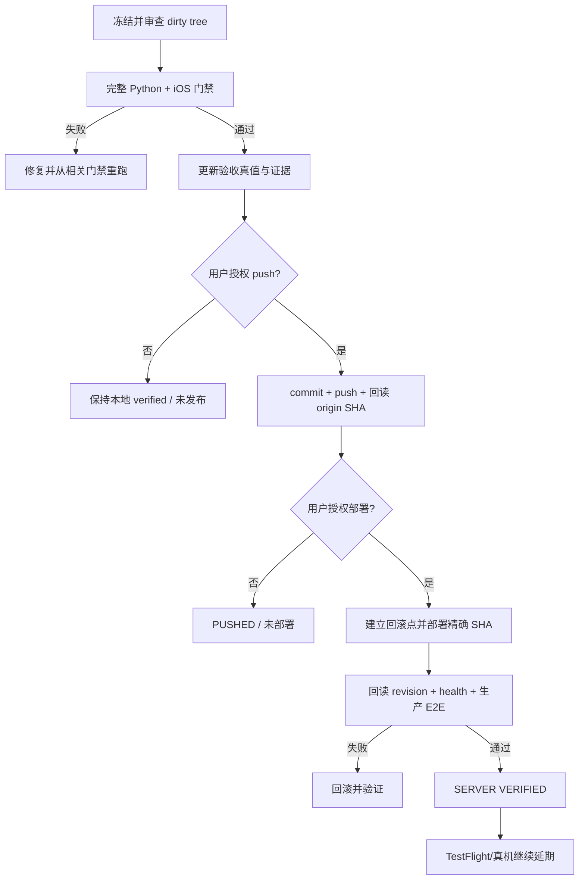

# Quantumn 文档与 PPT 整改发布交接

> [!danger] 当前发布结论
> **立即推送/部署：NO-GO。** 当前整改代码仍在本地未提交工作树中：21 个已跟踪文件修改、5 个未跟踪文件。`HEAD == origin/main == 27f6a4aad6c824e2ecf46329acbac069d522474c`，因此现在直接 `git push` 不会包含本次整改。
>
> **本地模拟器主链：已通过。** 真机、TestFlight 和当前最终 SHA 的服务器部署尚未执行，不能称“已发布”或“全部完成”。

## 1. 交接目标

本文件供后续执行者继续完成以下闭环：

1. 固化当前工作树与模拟器证据；
2. 对最终工作树执行完整发布门禁；
3. 审查、提交并推送 GitHub `main`；
4. 以精确 commit SHA 部署 Backend、Hermes Bridge、Planning Worker 和 Execution Worker；
5. 回读服务器 revision、健康、功能、产物和回滚点；
6. 按用户决定，**暂缓** TestFlight 和物理真机验收；
7. 未来恢复真机验收时，必须使用新构建，不得复用旧 Archive/旧构建号。

需求真源：[[20260915-quantumn-document-ppt-product-remediation-plan]]
真实性补充：[[20260917-quantumn-remediation-truth-addendum]]

## 2. 当前 Git 真值

- 仓库：`/Users/dengzhaoyu/Projects/ai-lab-platform-ios-document-ppt-final-20260912`
- 分支：`main`
- 本地 HEAD：`27f6a4aad6c824e2ecf46329acbac069d522474c`
- `origin/main`：`27f6a4aad6c824e2ecf46329acbac069d522474c`
- 已跟踪修改：21 个文件
- 未跟踪：5 个文件
- `git diff --check`：通过
- 当前没有 commit、push、服务器部署、Archive 或 TestFlight 上传收据。

> [!warning] 不得破坏现场
> 不得执行 `git reset --hard`、`git clean -fd`、覆盖式 checkout 或删除未跟踪文件。当前工作树包含本轮实现、测试、验收资料及此前尚未提交的项目改动，必须逐文件审查后选择性暂存。

### 当前工作树文件

已跟踪修改：

- `backend/api/workflows.py`
- `backend/capability_handlers.py`
- `backend/contracts/product-capabilities/capabilities.yaml`
- `backend/contracts/workflow/structured-review.schema.json`
- `backend/services/presentation_scenario.py`
- `backend/services/workflow_executor.py`
- `backend/services/workflow_reviews.py`
- `docs/product-capability-coverage.json`
- `docs/product-capability-manual.md`
- `ios/AIPlatformApp.xcodeproj/project.pbxproj`
- `ios/AIPlatformApp/Info.plist`
- `ios/AIPlatformApp/Networking/APIClient.swift`
- `ios/AIPlatformApp/Views/Workflows/StructuredReviewView.swift`
- `ios/AIPlatformApp/Views/Workflows/WorkflowDashboardView.swift`
- `ios/AIPlatformAppTests/WorkflowLifecycleDTOTests.swift`
- `ios/AIPlatformAppUITests/ProductionBookshelfUITests.swift`
- `ios/project.yml`
- `scripts/hermes_bridge.py`
- `tests/test_document_presentation.py`
- `tests/test_product_capabilities.py`
- `tests/test_workflows_api.py`

未跟踪：

- `backend/contracts/workflow/structured-review-v2.schema.json`
- `ios/AIPlatformAppUITests/ProductionSessionIsolationUITests.swift`
- `ops/acceptance/20260917-novice-user-observation.md`
- `ops/acceptance/20260917-quantumn-remediation-truth-addendum.json`
- `ops/acceptance/20260917-quantumn-remediation-truth-addendum.md`

本交接文档写入后也会成为新的未跟踪文件。

## 3. 已完成实现与问题修复

### 3.1 PPT 默认三步与可信上游绑定

- `scripts/hermes_bridge.py`：允许无 `approval_gate` 的 outline/design 在状态、attempt、内容哈希和 artifact 引用完全匹配时作为 verified ungated stage；若节点存在于 `approved_gates`，仍保留人工审批语义。
- `backend/services/workflow_executor.py`：与 Bridge 使用一致的严格投影规则，拒绝陈旧、错 attempt 或被篡改产物。
- `backend/services/presentation_scenario.py`：默认 PPT 主链按“需求确认 → 可编辑全稿预览 → 下载”工作，不再生成默认中间审批门。
- `tests/test_document_presentation.py`：增加无门控可信绑定、投影和防篡改回归。

原错误 `approved presentation design is missing` 的含义：最终 PPT 阶段找不到旧规则认可的可信 design。根因不是 Xcode 构建失败，而是默认无门控 design 被旧“人工批准阶段”判定为缺失。

### 3.2 Structured Review

- 已覆盖文本、长文本、列表、页面结构、素材对象、预览、恢复、保存、ETag/CAS、冲突展示、撤销和 App 重启持久化。
- `ProductionBookshelfUITests.swift` 已修正 SwiftUI `Link` 的 accessibility 查询，并在保存前确认主按钮可点击。

### 3.3 会话隔离

- 新增 `ProductionSessionIsolationUITests.swift`。
- 覆盖跨账号访问、深链 fail closed、切换账号、冷启动后 owner A 恢复，以及 owner B 持续 404。
- 测试签名密钥不再硬编码，改为 `LIVE_ACCEPTANCE_JWT_SECRET_FILE` 受控文件注入。
- 本轮临时密钥文件已删除；不得把密钥写入仓库、日志或交接文档。

### 3.4 Word / 研究报告 / 学术论文

三条真实 iOS Simulator 产品链均已从 App 发起，通过 Backend、Hermes Bridge、Planning Worker 和 Execution Worker，并完成审核、修改、Structured Review、最终 DOCX 及内容回执校验：

- Word：至少三页，两处指定修改，旧值消失，新值存在，重新下载版本化 DOCX。
- 研究报告：至少两个页面，三条独立 HTTPS 来源与正文引用对应，完成修改回路。
- 学术论文：完整论文结构，三条已验证 DOI 对应，`unverified.invalid` fail closed，完成修改回路。

## 4. 已回读的模拟器证据

运行平台：iOS 26.1 Simulator。所有数字均来自 `.xcresult` 或 XCTest 最终摘要。

| 范围 | 最终结果 | 证据 |
|---|---:|---|
| iOS 客户端完整单测（正常本地签名） | 212 passed / 0 failed / 0 skipped | `/tmp/Quantumn-Remediation-Simulator-AppTests-Signed.xcresult` |
| PPT 三步主链与 PPTX 下载 | 1 / 1 passed | `/tmp/Quantumn-Remediation-PPT3-Retry10.xcresult` |
| Word | 1 / 1 passed | `/tmp/Quantumn-Remediation-Simulator-NonPPT.xcresult` |
| 研究报告 | 1 / 1 passed | 同上 |
| 学术论文 | 1 / 1 passed | 同上 |
| Structured Review CAS/冲突/重启 | 1 / 1 passed | `/tmp/Quantumn-Remediation-Simulator-Isolation-Review-Retry.xcresult` |
| 跨账号隔离/冷启动 | 1 / 1 passed | 同上 |
| 小屏键盘、Agent 描述、重试、折叠导航 | 4 / 4 passed | `/tmp/Quantumn-Remediation-Simulator-UX.xcresult` |

最终有效范围合计：**222 passed / 0 unresolved failures / 0 skipped**。

> [!warning] 保留失败历史，不混淆最终结果
> `/tmp/Quantumn-Remediation-Simulator-NonPPT.xcresult` 的组合摘要是 3 passed / 2 failed。三个文档 E2E 真实通过；另外两个失败分别是隔离测试 JWT 密钥配置错误和 Structured Review UI 测试定位/点击不稳。两项修复后已在 `/tmp/Quantumn-Remediation-Simulator-Isolation-Review-Retry.xcresult` 以 2/2 通过。不得删除失败事实，也不得将旧组合 bundle 直接声称为 5/5。

Python 文档/PPT专项回归：

```text
51 passed, 8 warnings in 7.25s
```

警告均为 Pydantic/FastAPI deprecated API，不是本轮测试失败，但应进入后续技术债列表。

> [!info] 临时证据已清理
> 2026-09-17 11:38 CST，`/tmp` 与用户主目录下本项目的 DerivedData、Archive、`.xcresult`、截图、日志、测试数据库、JWT、临时启动脚本和旧测试样稿共 443 个顶层条目、184,623 个文件、25,143,802,979 字节，已分批核验并永久删除。
>
> 清理收据：
> `ops/acceptance/20260917-dev-test-cleanup-receipt.json`
>
> 上表保留的是执行时原始路径和结果摘要；完整二进制测试产物已按用户要求清理，不能再从 `/tmp` 或本次专用废纸篓目录恢复。后续发布门禁需要重新生成新的 `.xcresult`、Artifact 和哈希，不得引用已删除文件作为现存证据。

## 5. 当前运行环境与限制

- 本地验收 Backend、Hermes Bridge、Planning Worker、Execution Worker 已于 2026-09-17 11:38 CST 停止；端口 `8765`、`9118` 已释放。
- Planning Worker、Execution Worker、Bridge 在本轮真实 Simulator 链中均被实际消费；停止服务不改变已回读的测试结果，但重新验收前需按受控配置重新启动并检查 health。
- 本地验收 Backend 使用过 `QUANTUM_MONTHLY_TOKEN_LIMIT=10000000` 解开测试数据库累计额度阻断；这是**本地验收配置**，不是生产配额修复，不得原样部署生产。
- `/tmp/quantumn-live-acceptance.jwt`、测试数据库、临时启动脚本及相关日志已移入上述废纸篓目录，不再是活动凭据或运行源；不得提交或复用到生产。
- 本轮创建的 `/tmp/quantumn-live-acceptance.jwt-secret` 已删除并验证不存在。

## 6. 真机与 TestFlight 状态

用户已明确：**暂不做真机验证**。

Mac 能识别配对过的物理设备：

- 设备：iPhone 17 Pro「囧尼部落」
- iOS：26.6
- Developer Mode：enabled
- Pairing：paired
- 当前连接：`unavailable`
- Tunnel：`unavailable`
- USB/Thunderbolt：未连接

iPhone 不在 Mac 附近时，Mac 的 iPhone 镜像和 Xcode 均不能替代远程真机执行。当前不得声称已做真机验证。

未来恢复真机验收时：

1. iPhone 与 Mac 靠近，开启 Wi‑Fi/蓝牙并解锁确认，或使用数据线；
2. `xcrun devicectl list devices` 必须显示 `available`；
3. 查询 ASC 当前最新构建号，生成新的 Archive；
4. 不复用旧 Archive 或旧构建号；
5. 上传 TestFlight 后回读 processing/build 状态；
6. 在物理设备安装该精确构建并执行 PPT、Word、报告、论文、隔离、冷启动和下载验收；
7. 保存真机 UDID、destination、build number、截图/录屏和结果回执。

## 7. 后续必须执行的发布步骤

### Gate 1：冻结并审查最终工作树

- [ ] 再次运行 `git status --short --branch`、`git diff --stat`、`git diff --check`。
- [ ] 逐文件审查 21 个已跟踪修改和全部未跟踪文件；确认每项都属于本整改范围。
- [ ] 搜索并清除 JWT、密钥、数据库 URL、临时 IP 配置、调试 print、测试额度覆盖和本地绝对凭据路径。
- [ ] 确认 `backend/api/chat.py`、`backend/services/inference_policy.py` 没有遗留临时诊断 diff；此前已回读为 clean，但最终提交前必须复核。
- [ ] 核对 `ios/project.yml` 与 `AIPlatformApp.xcodeproj/project.pbxproj` 一致，确保新 UI Test 文件实际进入 target。
- [ ] 不得为了全绿而删除测试、跳过测试、放宽鉴权、放宽来源绑定或修改断言预期。

### Gate 2：最终工作树完整测试

必须使用仓库 `.venv` 且 `PYTHONPATH=.`：

```bash
cd /Users/dengzhaoyu/Projects/ai-lab-platform-ios-document-ppt-final-20260912
PYTHONPATH=. .venv/bin/python -m pytest -q
```

- [ ] 完整 Python suite 通过；不能用 51 项专项代替全量。
- [ ] 运行服务器发布契约：`tests/test_server_deployment_contract.py`、`tests/test_deploy_current_release_cas.py`。
- [ ] 使用正常本地签名重新 `build-for-testing`，不得以 `CODE_SIGNING_ALLOWED=NO` 产物验证 Keychain。
- [ ] 重跑 `AIPlatformAppTests` 全量并保留单一最终 `.xcresult`。
- [ ] 若 Gate 1 后有任何产品代码变化，重跑 10 条关键 UI/E2E，不得沿用本交接中的旧结果。
- [ ] 重新生成 PPTX/PDF/DOCX 并验证真实文件结构、哈希、来源 manifest、页数和内容，不仅检查按钮出现。
- [ ] 对 PPT 最新成品执行 montage、媒体对象、地图、SVG、裁切、溢出和重叠检查。
- [ ] PPT 内容与视觉仍需用户人工确认；自动化不替代该门禁。

### Gate 3：补齐仍未覆盖的生产矩阵

当前跨账号测试不能代表整改计划中的完整矩阵。至少仍需：

- [ ] 两账号 × 每账号两会话；
- [ ] 四个任务并发；
- [ ] A/B 会话快速切换；
- [ ] 退出登录并重新登录；
- [ ] 杀进程与冷启动恢复；
- [ ] 人为制造旧请求晚于新请求返回；
- [ ] 混入升级前 legacy workflow；
- [ ] 对 activity、深链、artifact 列表和下载逐项确认无跨 owner/session 数据；
- [ ] 保存每个场景的 workflow/run/artifact/owner/session/generation 回执。

若这些场景只在本地模拟器执行，状态只能写 `simulator_verified`；部署后还需生产回读，不能外推。

### Gate 4：更新验收真值

- [ ] 更新 `20260917-quantumn-remediation-truth-addendum.md/.json`。
- [ ] 写入本轮 212 单测、10 条关键 UI/E2E、51 项 Python 专项的精确结果与证据路径。
- [ ] 明确旧失败 bundle 与修复后复测 bundle 的对应关系。
- [ ] 标注 `physical_device: deferred_by_user`、`testflight: deferred_by_user`。
- [ ] 更新 remediation plan 逐项矩阵：`implemented | simulator_verified | production_verified | deferred | failed | unverified`。
- [ ] 更新 README/MANIFEST（若仓库发布流程要求）及最终测试数字；禁止沿用旧轮次数字。
- [ ] 记录剩余风险、回滚命令和删除临时凭据的回执。

### Gate 5：提交与 GitHub 推送

这是外部写入，必须取得用户明确授权后执行。

- [ ] 选择性 `git add` 所有目标文件，包括未跟踪的新 schema、UI Test 和验收文档。
- [ ] 运行 `git diff --cached --check`。
- [ ] 检查 `git diff --cached --stat` 与 staged diff，确认没有凭据和无关文件。
- [ ] 创建单一可审计提交；提交信息应说明文档/PPT整改、模拟器 E2E 和发布边界。
- [ ] 记录 commit SHA。
- [ ] `git push origin main`。
- [ ] 回读远端，要求 `git rev-parse HEAD == git rev-parse origin/main`。
- [ ] 若远端有新提交，停止并处理冲突；不得强推或覆盖远端。

### Gate 6：服务器部署精确 SHA

这是外部状态变更，必须取得用户明确部署授权。部署前先阅读并审查：

- `scripts/deploy_exact_sha.sh`
- `scripts/deploy.sh`
- `tests/test_server_deployment_contract.py`
- `tests/test_deploy_current_release_cas.py`

执行要求：

- [ ] 核对当前受限管理账号、host key、活动 release 和服务器当前 SHA；不得复用旧 root/旧 IP/旧凭据。
- [ ] 为当前线上 release 建立不可变回滚点，记录 `server_before`。
- [ ] 仅部署已经推送并回读的精确 GitHub SHA；不得 rsync dirty tree 冒充版本化部署。
- [ ] 明确检查是否包含数据库/schema migration；若部署脚本隐含 migration，需确认授权范围和回滚策略。
- [ ] Backend、Hermes Bridge、Planning Worker、Execution Worker 必须加载同一目标 revision 或记录其独立 revision。
- [ ] 不得把本地 `QUANTUM_MONTHLY_TOKEN_LIMIT=10000000` 验收覆盖带入生产。
- [ ] 不得输出或记录完整环境变量、JWT、DATABASE_URL 或密钥。

### Gate 7：部署后回读与生产验证

成功命令退出码不等于部署完成。必须回读：

- [ ] `.deployed-sha` 与目标 commit SHA 一致；
- [ ] 服务器工作树/容器文件哈希与该 SHA 一致；
- [ ] Backend、Bridge、Planning Worker、Execution Worker 的实际 PID/镜像/revision；
- [ ] Backend/Bridge health；
- [ ] 无凭证路由仍按预期拒绝，鉴权和租户隔离未被放宽；
- [ ] 旧 iOS 客户端关键 API 兼容，不崩溃、不误读新字段；
- [ ] 新建 clean-room PPT workflow，验证默认无中间审批门、最终 PPTX/PDF 和可信绑定；
- [ ] 新建 Word、研究报告、论文产品链，验证最终 artifact、内容、来源和修改回执；
- [ ] Structured Review CAS/冲突/重启持久化；
- [ ] 完整生产隔离矩阵；
- [ ] `server_after`、回滚点、健康探针、workflow IDs、artifact IDs、哈希和失败项进入部署收据。

任何一项失败：

1. 停止扩大流量；
2. 保存失败证据；
3. 回滚到 `server_before`；
4. 回读回滚后 SHA、进程和 health；
5. 本地修复、完整重跑后生成新 SHA，禁止在服务器热改源码。

### Gate 8：iOS 发布——当前延期

根据用户当前决定，以下项目保持 deferred，不得自动执行：

- [ ] Archive；
- [ ] 上传 TestFlight；
- [ ] ASC 构建号回读；
- [ ] 物理真机安装；
- [ ] 真机端到端验收。

服务器部署不等于 iOS 新版本已发布。iOS UI 变更只有进入新的 TestFlight/App Store 构建后，其他用户才会获得。

## 8. 推荐的执行顺序与停止条件



立即停止并报告的条件：

- 完整测试有任何失败或 skipped 被误当通过；
- staged diff 含凭据、临时配置或无关文件；
- `origin/main` 在提交前发生变化；
- 服务器当前 SHA、活动 release 或回滚点无法确认；
- migration 不可逆或不在授权范围；
- 部署后任何组件 revision 不一致；
- 生产隔离、来源绑定、artifact 哈希或兼容性探针失败。

## 9. 最终状态口径

在完成不同阶段时只能使用以下表述：

| 阶段 | 允许表述 |
|---|---|
| 当前 | 本地实现与关键模拟器链通过；未提交、未推送、未部署、未真机验证 |
| Commit 后 | 已提交本地；未推送、未部署 |
| Push 后 | GitHub `main` 已包含目标 SHA；服务器未部署 |
| 部署后未回读 | 已执行部署；尚未验证 |
| 部署回读通过 | 服务器目标 SHA 已部署并通过指定生产探针 |
| TestFlight 延期 | iOS 新 UI 尚未发布到 TestFlight/真机 |
| 全部门禁完成 | 仅在生产矩阵、artifact、用户 PPT 视觉确认和真机/TestFlight（如恢复要求）均有回执后使用 |

> [!failure] 禁止表述
> 不得因为模拟器 222 项通过，就写“全部完成”“已上线”“模拟器和真机都验证”“生产已恢复”或“所有整改项均通过”。

## 10. 下一位执行者的首批命令

只读检查：

```bash
cd /Users/dengzhaoyu/Projects/ai-lab-platform-ios-document-ppt-final-20260912
git status --short --branch
git rev-parse HEAD
git rev-parse origin/main
git diff --stat
git diff --check
```

随后先做完整测试和证据更新；**没有用户明确授权，不执行 commit、push、部署、Archive、TestFlight 上传或任何服务器写入。**
