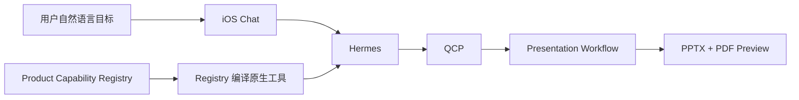

# Quantumn iOS Build 40 PPT 主链最终交接

> [!warning] 交接结论
> **主链修复、生产部署、PPTX 生成、App 内预览与下载、Build 40 真机 Archive 均已验证。**
>
> 但最终生产 SHA 上尚未从一条全新自然语言请求开始完成一次 clean-room E2E，旧 completion manifest 也未更新。因此当前发布判定仍为：**NO-GO**。

## 1. 当前真源

```text
task_id: 20260914-ios-build40-ppt-registry-routing
worktree: /Users/dengzhaoyu/Projects/ai-lab-platform-ios-document-ppt-final-20260912
branch: main
local_head: 7a7967989bd8e7258044bc23e6ed67abd75375cd
origin_main: 7a7967989bd8e7258044bc23e6ed67abd75375cd
production_sha: 7a7967989bd8e7258044bc23e6ed67abd75375cd
production_domain: https://t-react.com
final_archive: /tmp/Quantumn-1.0.3-40.xcarchive
```

生产 release：

```text
current: /opt/releases/ai-lab-platform-7a7967989bd8.kblqiI
rollback_point: /opt/releases/ai-lab-platform-b33d14061cc1.xxuRyX
```

## 2. 最终架构口径



### 职责边界

- **Registry**：唯一能力事实源，定义 capability ID、input schema、确认点、默认策略、Artifact 契约与 handler binding。
- **Hermes**：唯一 AI Runtime，理解自然语言目标并从 Registry 编译出的原生工具中选择能力。
- **QCP**：负责鉴权、Schema 校验、确认、幂等和执行治理。
- **iOS**：只提交自然语言目标和呈现交互状态，不做 PPT 关键词识别，不自行选择具体 workflow/capability。

### 新能力

```text
presentation.create_from_text@1.0.0
```

纯文本 PPT 不再回退为客户端或通用 workflow 的隐式分支。

## 3. 已完成的代码修复

| SHA | 修复内容 |
|---|---|
| `51093d78d7d1254acc4bdcf72a1bc9719b1f6926` | Registry、Hermes、QCP、iOS routing 主修复 |
| `6397450a16ea14330acc84e05e483bad6a50ab0b` | iOS 底部布局；私有仓库精确 SHA 部署链 |
| `7cffe7784a42dfa7ae47af1df50e5403c088141b` | 纯文本材料不隐式读取私有知识 |
| `d6baf0e7d709efa5ae975a1bdc37142f62fcb517` | Hermes structured layout 安全归一化 |
| `5ae3c9537a545fb6a5b1cb55a06f67ed6d526daa` | 显式空 scope；retry authorization 刷新 |
| `cc8e6343b70de593f1854e4fbb8263adc4ba4f16` | 最终 deck 绑定 approved outline |
| `b33d14061cc1b9828d52aa82c72fc07ce5385f0e` | 最终页与 approved deck 确定性对齐 |
| `7a7967989bd8e7258044bc23e6ed67abd75375cd` | 允许 renderer-safe approved layout 降级 |

### 关键行为

1. 删除 iOS 的 PPT/Word 关键词业务路由。
2. iOS 不再在 `workflow.create` 与 `presentation.create_from_document` 之间自行分流。
3. Hermes 正常主链只使用 Registry 编译出的原生能力工具，不重新引入旧 `search/describe/invoke` 元工具。
4. requirements、clarification、review 和 retry 保留 `text_material` 或 `source_document`。
5. 文本材料充分时不插入 `presentation_research`。
6. `requested_scopes=None` 才允许使用默认知识范围；显式空 scope 必须保持为空。
7. retry 按持久化 workflow plan 刷新短期授权，但不扩大原 scope。
8. Hermes Bridge 对不兼容输出执行 renderer-safe 归一化。
9. 最终 deck 绑定 approved design、outline Artifact ID、hash 和 version。
10. 最终页数、顺序和标题与 approved outline 确定性对齐。
11. `MainTabView.bottomChrome` 统一承载 Workflow 活动条与浮动导航，避免遮挡 Chat 输入框。

## 4. 生产验证

最终部署 SHA：

```text
7a7967989bd8e7258044bc23e6ed67abd75375cd
```

已验证：

- API 容器健康。
- runtime contract audit 通过。
- Hermes Bridge：`status=ok`。
- Hermes Bridge：`workflow_orchestration=true`。
- 认证 `/api/v1/me` 返回 HTTP 200。
- 本地 `main`、GitHub `main` 与生产 SHA 一致。

> [!caution] Readiness 口径
> `https://t-react.com/ready` 曾返回前端 HTML fallback，不能把该页面当成后端 readiness JSON。复核应使用部署脚本实际 health check、Compose API health 或后端真实 readiness 地址。

复核命令：

```bash
ssh root@[REDACTED] '
  cat /opt/ai-lab-platform/.deployed-sha
  readlink /opt/ai-lab-platform
  cd /opt/ai-lab-platform
  docker compose ps
'
```

## 5. 生产 Workflow 与 Artifact

```text
workflow_id: wf_8afd2dbc6dc9cf89a1a62f4b4d395bd5
execution_id: wfr_ce897c973d6b47ef89fa7da451a29fb5
PPTX_artifact: wfa_8c4bde5e5617431abcf48f1adfe97005
PDF_preview_artifact: wfa_1d1d1f2ce8bc4e30805e0a950a685d56
artifact_version: 4
slides: 6
preview_status: ready
```

PPTX 文件验证：

```text
bytes: 43,376
magic: PK
sha256: 0fb6abb2e834bda74d3af3bedd982b7cb000fd34a910e6f4a84ace9acf125a37
```

App 私有目录中的下载文件与生产 PPTX Artifact 的 SHA-256 一致。

## 6. iOS App 与真机验收

### App 内已验证

- 打开最终 6 页 PPT 预览。
- 显示“下载可编辑 PPTX / 存储到文件 / 分享”。
- 唤起 iOS 系统分享面板。
- 系统面板显示“保存到‘文件’”。
- 下载文件真实落盘，hash 与生产 Artifact 一致。

### 真机环境

```text
device: iPhone 17 Pro
Xcode_destination_id: 00008150-000C50980244401C
CoreDevice_id: CFE79F35-1270-527D-8BD7-9AB60449B6DF
OS: iOS 26.6
device_architecture: arm64e
```

真机测试结果：

```text
result: Passed
passed: 1
failed: 0
skipped: 0
test: ProductionBookshelfUITests/testFinalBuild40PPTOnPhysicalDevice()
```

证据路径：

```text
/tmp/Quantumn-Build40-Physical.xcresult
/tmp/Quantumn-Build40-Physical-Attachments/
```

关键截图：

```text
/tmp/Quantumn-Build40-Physical-Attachments/E4C8122C-419E-4322-A2BE-C59D1A15BE9F.png
/tmp/Quantumn-Build40-Physical-Attachments/2900AD54-3B82-4C4E-8516-DB51C2875FA3.png
```

- 第一张：最终 6 页 PPT 预览与下载控件。
- 第二张：iOS 系统分享面板与“保存到‘文件’”。

### 二进制验收口径

真机 UI 测试使用 `test-without-building`，并将 `.xctestrun` 的 `UITargetAppPath` 和首个 `DependentProductPaths` 显式指向：

```text
/tmp/Quantumn-1.0.3-40.xcarchive/Products/Applications/AIPlatformApp.app
```

因此该测试绑定的是最终 iPhoneOS Archive，而不是 Simulator 构建。临时 UI 测试代码已从工作树恢复，不进入生产提交。

## 7. Build 40 Archive

```text
path: /tmp/Quantumn-1.0.3-40.xcarchive
version: 1.0.3
build: 40
platform: iPhoneOS
binary_architecture: arm64
signing_identity: Apple Development: Johnie Deng (G68222AH2P)
executable_sha256: e4cf2477f56d5dbad2c4db89a17aed08afa06f451eb9faedd974d7794e5abebe
codesign: valid on disk; satisfies Designated Requirement
```

最终 Archive 已安装到配对 iPhone，并成功启动。

> [!danger] Build 号风险
> Xcode 项目默认 `CURRENT_PROJECT_VERSION` 仍为 `38`。最终 Build 40 是归档时显式传入 `CURRENT_PROJECT_VERSION=40 MARKETING_VERSION=1.0.3` 生成。再次归档或上传前必须读取 Archive 内真实 `CFBundleVersion`，不能只看文件名。

旧 Archive：

```text
/tmp/Quantumn-1.0.3-40.pre-final.xcarchive
```

不得将旧 Archive 用作最终修复二进制。

## 8. 测试结果

```text
backend regression: 96 passed, 8 warnings
Ruff: passed
compileall: passed
git diff --check: passed
```

覆盖范围：

- Product Capability Registry contract；
- presentation normalization；
- workflow API；
- approved outline/design binding；
- renderer-safe layout fallback；
- knowledge scope；
- retry authorization。

8 个 warning 为既有 FastAPI lifespan 与 Pydantic 配置弃用警告，不是本次失败。

## 9. 已解决故障

1. **iOS 绕过 Hermes**：删除客户端关键词路由。
2. **纯文本 PPT 无一等能力**：新增 `presentation.create_from_text@1.0.0`。
3. **私有知识越界**：材料充分时不插入 research node。
4. **显式空 scope 被扩大**：严格区分 `None` 与空 iterable。
5. **retry 使用过期授权**：按持久化 plan 刷新短期授权。
6. **renderer 拒绝模型多余字段**：Bridge 受控归一化。
7. **最终 deck 偏离审批大纲**：绑定 approved outline，并确定性对齐页面结构。
8. **投影层误判安全 layout 降级**：允许 renderer-safe layout，同时保留 provenance 与结构校验。
9. **底部 UI 遮挡**：活动条和浮动导航改为统一纵向布局。
10. **私有 GitHub archive URL 返回 404**：使用本地精确 SHA `git archive`、SHA-256 与离线镜像 attestation。
11. **离线镜像 revision 不匹配**：为目标 SHA 构建并验证匹配镜像。
12. **真机首次启动失败**：原因是设备锁屏；解锁后成功启动，与二进制无关。

## 10. 尚未完成

### 发布前必须补齐

- [ ] 在最终生产 SHA `7a796798...` 上发起一条全新自然语言 PPT 请求。
- [ ] 不复用现有 `wf_8afd2...`，从 capability proposal 开始完整通过 requirements、plan、agent、outline、design、final preview 和 download。
- [ ] 验证该新 workflow 未隐式访问私有知识。
- [ ] 验证最终 PPTX 与 PDF preview 版本一致。
- [ ] 验证 App 下载文件 hash 与新 Artifact hash 一致。
- [ ] 保存新的 workflow、execution、Artifact ID、截图、XCResult 和下载 hash。
- [ ] 更新 `ops/change-manifests/20260914-ios-build40-ppt-registry-routing-completion.md`。
- [ ] 提交交接文档和 completion manifest，并在获得外部写入授权后推送 `main`。

### 未开始

- ASC/TestFlight 上传。
- App Store 发布。

不得声称：

- clean-room E2E 已完成；
- 已上传 TestFlight；
- 已发布或已上架。

## 11. 接手执行顺序

1. 检查工作树、分支、`HEAD`、`origin/main` 和 worktree。
2. 核对生产 `.deployed-sha`、release symlink、Compose health、image revision 和 Hermes Bridge。
3. 如 QA token 已过期，为原 workflow owner 对应 QA 用户签发短期 token；凭据只放临时文件，不输出、不提交。
4. 使用最终 Build 40 真机 App 发起一条新的纯文本 PPT 请求。
5. 完成全部确认门、最终预览与下载。
6. 记录新 workflow、execution、Artifact、hash、截图和 XCResult。
7. 更新 completion manifest 至实际最高状态。
8. 显式暂存本任务文档，不得使用 `git add .`。
9. 提交到本地 `main`；获得授权后推送 GitHub。
10. 用 `git ls-remote` 回读远端 SHA。
11. 如需 TestFlight，先查询 ASC 当前最高 build number；不得假设 Build 40 可复用。

开工检查：

```bash
cd /Users/dengzhaoyu/Projects/ai-lab-platform-ios-document-ppt-final-20260912
git status --short --branch
git branch --show-current
git rev-parse HEAD
git remote -v
git worktree list --porcelain
```

## 12. 关键文件

```text
backend/contracts/product-capabilities/capabilities.yaml
backend/contracts/product-capabilities/bindings.yaml
backend/services/capability_catalog.py
backend/capability_handlers.py
backend/api/workflows.py
backend/services/presentation_scenario.py
backend/services/presentation_renderer.py
backend/services/knowledge_policy.py
backend/services/workflow_executor.py
scripts/hermes_bridge.py
scripts/deploy_exact_sha.sh
scripts/update.sh
ios/AIPlatformApp/Views/Chat/Coordinators/TenantSessionCoordinator.swift
ios/AIPlatformApp/Networking/APIClient.swift
ios/AIPlatformApp/Views/MainTabView.swift
ios/AIPlatformApp/Views/Chat/ChatView.swift
ios/AIPlatformApp/Views/Chat/Components/ChatStatusCards.swift
ios/AIPlatformApp/Views/Workflows/WorkflowDashboardView.swift
tests/test_document_presentation.py
tests/test_knowledge_policy_v2.py
tests/test_product_capabilities.py
tests/test_workflows_api.py
ops/change-manifests/20260914-ios-build40-ppt-registry-routing-completion.md
```

## 13. 状态回执

```text
task_id: 20260914-ios-build40-ppt-registry-routing
status: VERIFIED（已完成生产主链与既有 workflow 验证）
branch: main
worktree: /Users/dengzhaoyu/Projects/ai-lab-platform-ios-document-ppt-final-20260912
head/local_commit: 7a7967989bd8e7258044bc23e6ed67abd75375cd
remote_sha: 7a7967989bd8e7258044bc23e6ed67abd75375cd
server_before: b33d14061cc1b9828d52aa82c72fc07ce5385f0e
server_after: 7a7967989bd8e7258044bc23e6ed67abd75375cd
health_check: passed
functional_check: existing production workflow, PPTX/PDF, App preview/download and physical Archive passed
rollback_point: /opt/releases/ai-lab-platform-b33d14061cc1.xxuRyX
manifest: ops/change-manifests/20260914-ios-build40-ppt-registry-routing-completion.md
remaining_risks: final-SHA clean-room workflow pending; completion manifest stale; ASC/TestFlight not started
release_decision: NO-GO
```
