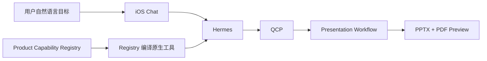

# Quantumn iOS Build 40 PPT 主链交接

> [!warning] 交接结论
> 当前代码、生产部署、PPTX 产物、App 内预览/下载和 Build 40 真机 Archive 均有真实验证证据；但**最终 SHA 上从全新请求开始的一次性 clean-room E2E 尚未执行**，completion manifest 也仍为旧状态。因此当前结论是：**主链已修复，发布仍为 NO-GO**。

## 一、接手入口

```text
仓库: /Users/dengzhaoyu/Projects/ai-lab-platform-ios-document-ppt-final-20260912
分支: main
本地 HEAD: 7a7967989bd8e7258044bc23e6ed67abd75375cd
GitHub main: 7a7967989bd8e7258044bc23e6ed67abd75375cd
生产 SHA: 7a7967989bd8e7258044bc23e6ed67abd75375cd
生产域名: https://t-react.com
生产服务器: [REDACTED]
最终 Archive: /tmp/Quantumn-1.0.3-40.xcarchive
旧 Archive 备份: /tmp/Quantumn-1.0.3-40.pre-final.xcarchive
```

接手后先执行：

```bash
cd /Users/dengzhaoyu/Projects/ai-lab-platform-ios-document-ppt-final-20260912
git status --short --branch
git branch --show-current
git rev-parse HEAD
git rev-parse origin/main
git remote -v
git worktree list --porcelain
```

预期：

- 当前分支为 `main`。
- `HEAD` 与 `origin/main` 都是 `7a7967989bd8e7258044bc23e6ed67abd75375cd`。
- 当前交接文档为未提交文件；不得误删或混入无关修改。

## 二、任务目标与最终口径

### 1. 能力事实源

- Product Capability Registry 是唯一能力事实源。
- 纯文本 PPT 使用一等能力 `presentation.create_from_text@1.0.0`。
- capability ID、input schema、默认策略、确认点、Artifact 契约和 handler binding 都由 Registry 定义。

### 2. 运行时职责



- iOS 只提交自然语言目标，不识别 PPT 关键词。
- iOS 不在 `workflow.create`、`presentation.create_from_document` 等 API 之间自行选择。
- Hermes 根据 Registry 编译出的原生工具选择能力。
- 正常模型工具集不重新引入旧 `search/describe/invoke` 元工具。
- QCP 负责鉴权、Schema、确认、幂等和执行治理。

### 3. 知识与授权边界

- 文本材料充分时，不插入 `presentation_research`，不读取未明确授权的私有知识空间。
- `requested_scopes=None` 才允许采用策略默认范围。
- 显式空 scope 必须保持为空，不得扩大。
- retry 可刷新短期 authorization，但 scope 不能超过持久化 workflow plan。
- requirements、clarification、review 和 retry 均保留原始 `text_material` 或 `source_document`。

### 4. PPT 最终稿约束

- Hermes 输出在 Bridge 层执行 renderer-safe 归一化。
- 最终 deck 绑定 approved design 和 approved outline 的 Artifact ID、hash、version。
- 页数、顺序、标题与 approved outline 对齐。
- layout 可以为满足严格 renderer 契约而安全降级，但不能新增未批准页面或改变标题结构。

## 三、已完成的代码提交

| SHA | 内容 |
|---|---|
| `51093d78d7d1254acc4bdcf72a1bc9719b1f6926` | Registry、Hermes、QCP、iOS PPT routing 主修复 |
| `6397450a16ea14330acc84e05e483bad6a50ab0b` | iOS 底部布局；私有仓库精确 SHA 部署链 |
| `7cffe7784a42dfa7ae47af1df50e5403c088141b` | 纯文本材料禁止隐式读取私有知识 |
| `d6baf0e7d709efa5ae975a1bdc37142f62fcb517` | Hermes structured layout 安全归一化 |
| `5ae3c9537a545fb6a5b1cb55a06f67ed6d526daa` | 显式空 scope；retry authorization 刷新 |
| `cc8e6343b70de593f1854e4fbb8263adc4ba4f16` | 最终 deck 绑定 approved outline |
| `b33d14061cc1b9828d52aa82c72fc07ce5385f0e` | 最终页与 approved deck 确定性对齐 |
| `7a7967989bd8e7258044bc23e6ed67abd75375cd` | 后端投影层允许 renderer-safe layout 降级 |

## 四、生产状态

最终部署回执：

```text
deployed_sha: 7a7967989bd8e7258044bc23e6ed67abd75375cd
release: /opt/releases/ai-lab-platform-7a7967989bd8.kblqiI
rollback_point: /opt/releases/ai-lab-platform-b33d14061cc1.xxuRyX
```

已验证：

- API 容器健康。
- runtime contract audit 通过。
- Hermes Bridge 返回 `status=ok`。
- Hermes Bridge 返回 `workflow_orchestration=true`。
- 认证 `/api/v1/me` 返回 HTTP 200。
- 本地 `main`、GitHub `main` 与生产 SHA 一致。

> [!caution] Readiness 口径
> `https://t-react.com/ready` 曾返回前端 HTML fallback，不能把该结果作为后端 readiness JSON。复核时应使用部署脚本内部 health check、Compose API health 或后端实际 readiness 地址。

生产复核命令：

```bash
ssh root@[REDACTED] '
  cat /opt/ai-lab-platform/.deployed-sha
  readlink /opt/ai-lab-platform
  cd /opt/ai-lab-platform
  docker compose ps
'
```

## 五、生产 PPT 产物

```text
workflow_id: wf_8afd2dbc6dc9cf89a1a62f4b4d395bd5
execution_id: wfr_ce897c973d6b47ef89fa7da451a29fb5
PPTX artifact: wfa_8c4bde5e5617431abcf48f1adfe97005
PDF preview: wfa_1d1d1f2ce8bc4e30805e0a950a685d56
artifact_version: 4
slides: 6
preview_status: ready
```

PPTX 验证值：

```text
bytes: 43,376
magic: PK
sha256: 0fb6abb2e834bda74d3af3bedd982b7cb000fd34a910e6f4a84ace9acf125a37
```

App 私有目录下载文件与生产 Artifact 的 SHA-256 一致。

## 六、iOS 验收证据

### 1. App 内已验证

- 真实认证 iOS App 打开最终 6 页 PPT 预览。
- 显示“下载可编辑 PPTX / 存储到文件 / 分享”。
- 点击下载后打开 iOS 系统分享面板。
- 系统分享面板显示“保存到‘文件’”。
- 最终 PPTX 已真实落盘，hash 与服务端 Artifact 一致。

### 2. 真机测试

```text
设备: iPhone 17 Pro
设备 ID: 00008150-000C50980244401C
系统: iOS 26.6
架构: arm64e
测试结果: Passed
passed: 1
failed: 0
skipped: 0
```

测试用例：

```text
ProductionBookshelfUITests/testFinalBuild40PPTOnPhysicalDevice()
```

真机结果与附件：

```text
/tmp/Quantumn-Build40-Physical.xcresult
/tmp/Quantumn-Build40-Physical-Attachments/
```

关键截图：

```text
/tmp/Quantumn-Build40-Physical-Attachments/E4C8122C-419E-4322-A2BE-C59D1A15BE9F.png
/tmp/Quantumn-Build40-Physical-Attachments/2900AD54-3B82-4C4E-8516-DB51C2875FA3.png
```

- 第一张：真机 6 页最终 PPT 预览及下载按钮。
- 第二张：真机 iOS 系统分享面板及“保存到‘文件’”。

### 3. 二进制绑定方式

真机 UI 测试使用 `test-without-building`；`.xctestrun` 中：

- `UITargetAppPath`
- 首个 `DependentProductPaths`

均显式指向：

```text
/tmp/Quantumn-1.0.3-40.xcarchive/Products/Applications/AIPlatformApp.app
```

因此验收目标是最终 iPhoneOS Archive，不是 Simulator 构建。临时 XCUITest 方法已从工作树恢复，不进入生产提交。

## 七、Build 40 Archive

```text
path: /tmp/Quantumn-1.0.3-40.xcarchive
size: 49M
version: 1.0.3
build: 40
platform: iPhoneOS
architecture: arm64
signing_identity: Apple Development: Johnie Deng (G68222AH2P)
executable_sha256: e4cf2477f56d5dbad2c4db89a17aed08afa06f451eb9faedd974d7794e5abebe
codesign: valid on disk; satisfies Designated Requirement
```

Archive 已安装到配对 iPhone 17 Pro，并成功启动。

> [!danger] Build 号陷阱
> Xcode 项目默认 `CURRENT_PROJECT_VERSION` 仍为 `38`。最终 Build 40 是归档时显式传入 `CURRENT_PROJECT_VERSION=40 MARKETING_VERSION=1.0.3` 生成。再次归档或上传前必须读取 Archive 内真实 `CFBundleVersion`，不能依赖文件名。

不得使用旧包：

```text
/tmp/Quantumn-1.0.3-40.pre-final.xcarchive
```

## 八、已解决的关键故障

1. **客户端绕过 Hermes**
   删除 iOS PPT/Word 关键词业务路由，自然语言目标统一交给 Hermes。

2. **纯文本能力缺失**
   Registry 增加 `presentation.create_from_text@1.0.0`。

3. **私有知识越界**
   文本材料充分时不再插入 `presentation_research`。

4. **空 scope 被扩大**
   明确区分 `None` 和显式空 iterable。

5. **retry 授权过期**
   retry 前按持久化 plan 刷新 authorization，同时保持原 scope。

6. **renderer 未消费字段**
   Bridge 对 structured layout 和字段执行受控归一化。

7. **最终 deck 偏离审批内容**
   最终页数、顺序和标题绑定 approved outline。

8. **Bridge 成功但后端投影失败**
   后端不再把 renderer-safe layout 降级误判为结构篡改。

9. **底部 UI 遮挡**
   `MainTabView.bottomChrome` 使用统一纵向容器承载 Workflow 活动条与浮动导航。

10. **私有仓库部署 404**
    部署改用精确 SHA 的本地 `git archive`、SHA-256 校验和匹配离线镜像。

## 九、回归测试

最终相关回归：

```text
96 passed, 8 warnings
Ruff: passed
compileall: passed
git diff --check: passed
```

覆盖：

- Registry capability contract；
- presentation normalization；
- workflow API；
- approved design/outline binding；
- renderer-safe layout fallback；
- knowledge scope；
- retry authorization。

8 个 warning 是既有 FastAPI lifespan 与 Pydantic 弃用警告，不是测试失败。

## 十、尚未完成

### 必须完成后才能宣布最终 GO

- [ ] 在最终生产 SHA `7a796798...` 上创建一条全新自然语言 PPT 请求。
- [ ] 不复用 `wf_8afd2...`，完整走一遍 capability proposal、requirements、plan、agent、outline、design、final deck、preview、download。
- [ ] 核对该新 workflow 未隐式读取私有知识。
- [ ] 核对最终 PPTX 与 PDF preview 同版本。
- [ ] 核对 App 下载文件 hash 与新 Artifact hash 一致。
- [ ] 更新 `ops/change-manifests/20260914-ios-build40-ppt-registry-routing-completion.md`。
- [ ] 提交并推送本交接文档与 completion manifest。

### 未开始

- ASC/TestFlight 上传。
- App Store 发布。

不得表述为：

- 已上传 TestFlight；
- 已发布；
- 已上架；
- 最终 clean-room E2E 已完成。

## 十一、接手后的执行顺序

1. 确认 `main`、`origin/main`、生产 SHA 和工作树。
2. 复核生产容器、release symlink、image revision 与 Hermes Bridge。
3. 如 QA token 已过期，为同一 QA 用户签发短期 token；不得输出或提交 token。
4. 在最终 Build 40 真机 App 中发起一个新的纯文本 PPT 请求。
5. 完成所有审批阶段、最终预览和下载。
6. 保存新 workflow、execution、Artifact、preview、hash、截图和 XCResult。
7. 将 completion manifest 更新为实际最高状态。
8. 显式暂存交接文档与 manifest，提交 `main`。
9. 获得外部写入授权后推送 GitHub，并用 `git ls-remote` 回读远端 SHA。
10. 如需 TestFlight，先实查 ASC 已占用 build number，再决定是否继续使用 Build 40。

## 十二、关键文件

```text
backend/contracts/product-capabilities/capabilities.yaml
backend/contracts/product-capabilities/bindings.yaml
backend/services/capability_catalog.py
backend/capability_handlers.py
backend/api/workflows.py
backend/services/presentation_scenario.py
backend/services/presentation_renderer.py
backend/services/knowledge_policy.py
backend/services/workflow_executor.py
scripts/hermes_bridge.py
scripts/deploy_exact_sha.sh
scripts/update.sh
ios/AIPlatformApp/Views/Chat/Coordinators/TenantSessionCoordinator.swift
ios/AIPlatformApp/Networking/APIClient.swift
ios/AIPlatformApp/Views/MainTabView.swift
ios/AIPlatformApp/Views/Chat/ChatView.swift
ios/AIPlatformApp/Views/Chat/Components/ChatStatusCards.swift
ios/AIPlatformApp/Views/Workflows/WorkflowDashboardView.swift
tests/test_document_presentation.py
tests/test_knowledge_policy_v2.py
tests/test_product_capabilities.py
tests/test_workflows_api.py
```

## 十三、最终状态

```text
task_id: 20260914-ios-build40-ppt-registry-routing
code: PUSHED
production: VERIFIED
production_artifact: VERIFIED
Build 40 Archive: VERIFIED
Build 40 physical-device preview/download: VERIFIED
clean-room workflow on final SHA: PENDING
completion manifest: STALE
ASC/TestFlight: NOT STARTED
release decision: NO-GO
```
